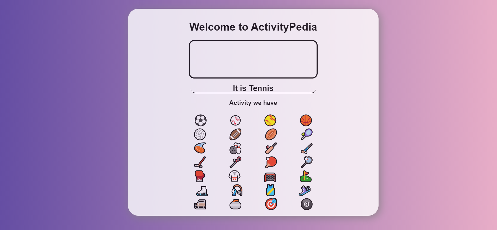

# ActivityPedia

ActivityPedia is the application that shows the meaning or name of the activity emoji 

## Technology 
- React
- CSS
- HTML

## Snapshot

## Connect me
- [Twitter](https://www.twitter.com/virendra_wadher)

- [Github](https://www.github.com/virendrawadher)

- [LinkedIn](https://www.linkedin.com/in/virendra-wadher-042741155/)

Created by Virendra Wadher

